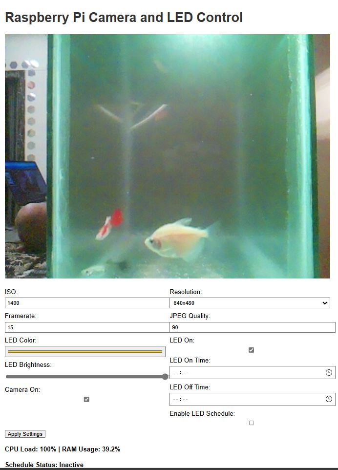

# WatchMyFish 🐠



WatchMyFish is an open-source project that turns your Raspberry Pi into a live-streaming aquarium camera with smart control features for LED lighting and accessories.

## 🌟 Features

- Live stream your aquarium to the web
- Control WS2811B LED strips for custom lighting effects
- Manage accessories like pumps and air filters
- Easy setup with Raspberry Pi and Pi Camera

## 🛠️ Hardware Requirements

- Raspberry Pi (3B+ or newer recommended`)
- Pi Camera module
- WS2811B LED strip
- Optional: Relay modules for pump/filter control

## 🚀 Getting Started

1. Clone this repository
2. Install dependencies
3. Configure your hardware connections
4. Run the setup script
5. Start streaming!

## Todo
- Fix led on scheduler 
- Add gpio for pump and filter control

## 💡 Usage

```bash
sudo python3 app.py
```
- add to crontab -e for running at startup
- Tested on Pi zero w and pi4 .
